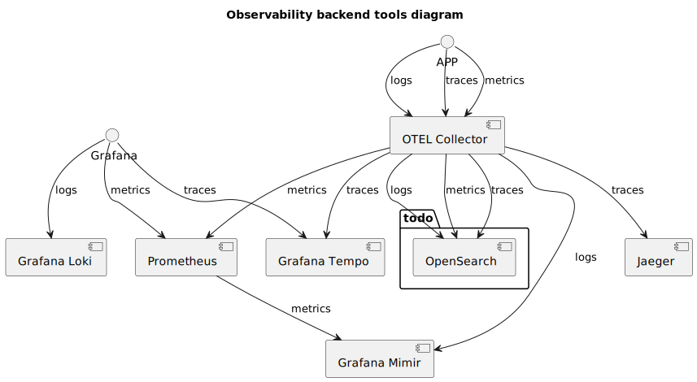

# observability-alternative-envs-lab #

A repository to try some setups to test
observability tools and approaches.


## Planned observability backend diagram ##



## Ports by service ##

- `Jaeger`:
  - `Web Interface`: 16686
- `Loki`:
  - `Query Interface`: 3100
- `Grafana`:
  - `Web Interface`: 3000


## Reference links ##

- [OTEL Collector installation](https://opentelemetry.io/docs/collector/installation/#linux)
- [OTEL Collector Agent mode configuration](https://opentelemetry.io/docs/collector/deployment/agent/)
- [OTEL Collector Configuration structure](https://opentelemetry.io/docs/collector/configuration/)


## code snippets ##

```shell
# OTEL Collector installation snippet
sudo apt-get update
sudo apt-get -y install wget systemctl
wget https://github.com/open-telemetry/opentelemetry-collector-releases/releases/download/v0.102.0/otelcol_0.102.0_linux_arm64.deb
sudo dpkg -i otelcol_0.102.0_linux_arm64.deb
```

```shell
# Install Loki plugin to Docker
docker plugin install grafana/loki-docker-driver:2.9.2 --alias loki --grant-all-permissions
```